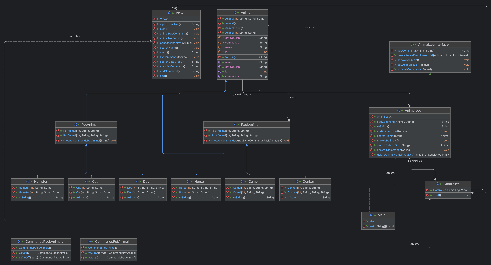

### Итоговая контрольная работа

Необходимо организовать систему учета для питомника, 
в котором живут домашние и Pack animals.

## Операционные системы и виртуализация (Linux)

### 1. Использование команды cat в Linux
   - Создать два текстовых файла: "Pets"(Домашние животные) и "Pack animals"(вьючные животные), 
     используя команду `cat` в терминале Linux. В первом файле перечислить собак, кошек и хомяков. 
     Во втором — лошадей, верблюдов и ослов.
   - Объединить содержимое этих двух файлов в один и просмотреть его содержимое.
   - Переименовать получившийся файл в "Human Friends"(.
     Пример конечного вывода после команды “ls” :
     Desktop Documents Downloads  HumanFriends.txt  Music  PackAnimals.txt  Pets.txt  Pictures  Videos

>~# cd finalhw

>~# vi pets.txt

> ~# cat pets.txt

ID	Name	    	Type		BirthDate	    Commands
1	Fido	    	Dog	    	2020-01-01	    Sit, Stay, Fetch
2	Whiskers	    Cat	    	2019-05-15	    Sit, Pounce
3	Hammy	    	Hamster		2021-03-10	    Roll, Hide
4	Buddy	    	Dog	    	2018-12-10	    Sit, Paw, Bark
5	Smudge	    	Cat	    	2020-02-20	    Sit, Pounce, Scratch
6	Peanut	    	Hamster		2021-08-01	    Roll, Spin
7	Bella	    	Dog	    	2019-11-11	    Sit, Stay, Roll
8	Oliver	    	Cat	    	2020-06-30	    Meow, Scratch, Jump

> ~# vi pack_animals.txt

> ~# cat pack_animals.txt

ID	Name		Type		    BirthDate	Commands
1	Thunder		Horse		    2015-07-21	Trot, Canter, Gallop
2	Sandy		Camel		    2016-11-03	Walk, Carry Load
3	Eeyore		Donkey		    2017-09-18	Walk, Carry Load, Bray
4	Storm		Horse		    2014-05-05	Trot, Canter
5	Dune		Camel		    2018-12-12	Walk, Sit
6	Burro		Donkey		    2019-01-23	Walk, Bray, Kick
7	Blaze		Horse		    2016-02-29	Trot, Jump, Gallop
8	Sahara		Camel		    2015-08-14	Walk, Run

>~# cat pets.txt pack_animals.txt > human_friends.txt

> ~# cat human_friends.txt

ID	Name	    	Type		    BirthDate	    Commands
1	Fido	    	Dog	    	    2020-01-01	    Sit, Stay, Fetch
2	Whiskers	    Cat	    	    2019-05-15	    Sit, Pounce
3	Hammy	    	Hamster		    2021-03-10	    Roll, Hide
4	Buddy	    	Dog	    	    2018-12-10	    Sit, Paw, Bark
5	Smudge	    	Cat	    	    2020-02-20	    Sit, Pounce, Scratch
6	Peanut	    	Hamster		    2021-08-01	    Roll, Spin
7	Bella	    	Dog	    	    2019-11-11	    Sit, Stay, Roll
8	Oliver	    	Cat	    	    2020-06-30	    Meow, Scratch, Jump
ID	Name		    Type		    BirthDate	    Commands
1	Thunder		    Horse		    2015-07-21	    Trot, Canter, Gallop
2	Sandy		    Camel		    2016-11-03	    Walk, Carry Load
3	Eeyore		    Donkey		    2017-09-18	    Walk, Carry Load, Bray
4	Storm		    Horse		    2014-05-05	    Trot, Canter
5	Dune		    Camel		    2018-12-12	    Walk, Sit
6	Burro		    Donkey		    2019-01-23	    Walk, Bray, Kick
7	Blaze		    Horse		    2016-02-29	    Trot, Jump, Gallop
8	Sahara		    Camel		    2015-08-14	    Walk, Run

> ~# ls 

human_friends.txt  pack_animals.txt  pets.txt

### 2. Работа с директориями в Linux
   - Создать новую директорию и переместить туда файл "Human Friends".

> ~# ls -l

> ~# mkdir human_friends

> ~# cd human_friends

> ~# ls -l

> ~# mv human_friends.txt /root/gb/finalhw/human_friends/

>~# ls -l

### 3. Работа с MySQL в Linux. “Установить MySQL на вашу вычислительную машину ”
   - Подключить дополнительный репозиторий MySQL и установить один из пакетов из этого репозитория.

### 4. Управление deb-пакетами
   - Установить и затем удалить deb-пакет, используя команду `dpkg`.

> ~# mkdir mysql

> ~# cd mysql

> ~# wget https://dev.mysql.com/get/mysql-apt-config_0.8.12-1_all.deb

> ~# dpkg -i mysql-apt-config_0.8.12-1_all.deb

> ~# apt-get update

> ~# apt-get install mysql-server

> ~# systemctl status mysql

> ~# apt-get remove mysql-apt-config_0.8.12-1_all.deb

> ~# ls -l

> ~# apt-get autoremove

> ~# ls -l

> ~# rm mysql-apt-config_0.8.12-1_all.deb

### 5. История команд в терминале Ubuntu
- Сохранить и выложить историю ваших терминальных команд в Ubuntu.
В формате: Файла с ФИО, датой сдачи, номером группы(или потока)

> ~# history

## Объектно-ориентированное программирование

### 6. Диаграмма классов
- Создать диаграмму классов с родительским классом "Животные", и двумя подклассами: "Pets" и "Pack_animals".
В составы классов которых в случае Pets войдут классы: собаки, кошки, хомяки, а в класс Pack_animals войдут: 
Лошади, верблюды и ослы).
Каждый тип животных будет характеризоваться (например, имена, даты рождения, выполняемые команды и т.д)
Диаграмму можно нарисовать в любом редакторе, такими как Lucidchart, Draw.io, Microsoft Visio и других.

Диаграмма классов 

### 7. Работа с MySQL (Задача выполняется в случае успешного выполнения задачи “Работа с MySQL в Linux. 
“Установить MySQL на вашу машину”

#### 7.1. После создания диаграммы классов в 6 пункте, в 7 пункте база данных "Human Friends" должна быть структурирована в соответствии с этой диаграммой. Например, можно создать таблицы, которые будут соответствовать классам "Pets" и "Pack animals", и в этих таблицах будут поля, которые характеризуют каждый тип животных (например, имена, даты рождения, выполняемые команды и т.д.).

#### 7.2. В ранее подключенном MySQL создать базу данных с названием "Human Friends".
 Создать таблицы, соответствующие иерархии из вашей диаграммы классов.
- Заполнить таблицы данными о животных, их командах и датами рождения.
- Удалить записи о верблюдах и объединить таблицы лошадей и ослов.
- Создать новую таблицу для животных в возрасте от 1 до 3 лет и вычислить их возраст с точностью до месяца.
- Объединить все созданные таблицы в одну, сохраняя информацию о принадлежности к исходным таблицам.

Пример заполненной таблицы для теста:
Лист "Pets"
ID	Name	    Type	BirthDate	    Commands
1	Fido	    Dog	    2020-01-01	    Sit, Stay, Fetch
2	Whiskers	Cat	    2019-05-15	    Sit, Pounce
3	Hammy	    Hamster	2021-03-10	    Roll, Hide
4	Buddy	    Dog	    2018-12-10	    Sit, Paw, Bark
5	Smudge	    Cat	    2020-02-20	    Sit, Pounce, Scratch
6	Peanut	    Hamster	2021-08-01	    Roll, Spin
7	Bella	    Dog	    2019-11-11	    Sit, Stay, Roll
8	Oliver	    Cat	    2020-06-30	    Meow, Scratch, Jump

Лист "PackAnimals"
ID	Name	Type	    BirthDate	    Commands
1	Thunder	Horse	    2015-07-21	    Trot, Canter, Gallop
2	Sandy	Camel	    2016-11-03	    Walk, Carry Load
3	Eeyore	Donkey	    2017-09-18	    Walk, Carry Load, Bray
4	Storm	Horse	    2014-05-05	    Trot, Canter
5	Dune	Camel	    2018-12-12	    Walk, Sit
6	Burro	Donkey	    2019-01-23	    Walk, Bray, Kick
7	Blaze	Horse	    2016-02-29	    Trot, Jump, Gallop
8	Sahara	Camel	    2015-08-14	    Walk, Run

### 8. ООП и Java
- Создать иерархию классов в Java, который будет повторять диаграмму классов созданную в задаче 6(Диаграмма классов)

### 9. Программа-реестр домашних животных
- Написать программу на Java, которая будет имитировать реестр домашних животных.
    Должен быть реализован следующий функционал:

#### 9.1. Добавление нового животного
- Реализовать функциональность для добавления новых животных в реестр.       
Животное должно определяться в правильный класс (например, "собака", "кошка", "хомяк" и т.д.)

#### 9.2. Список команд животного
- Вывести список команд, которые может выполнять добавленное животное (например, "сидеть", "лежать").

#### 9.3. Обучение новым командам
- Добавить возможность обучать животных новым командам.

#### 9.4 Вывести список животных по дате рождения

#### 9.5. Навигация по меню
- Реализовать консольный пользовательский интерфейс с меню для навигации между вышеуказанными функциями.

### 10. Счетчик животных
- Создать механизм, который позволяет вывести на экран общее количество созданных животных любого типа 
(Как домашних, так и вьючных), то есть при создании каждого нового животного счетчик увеличивается на “1”. 
  

